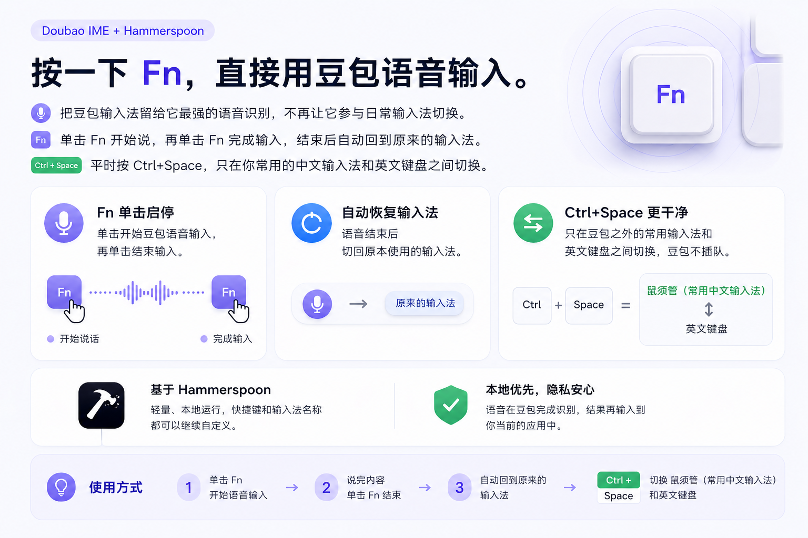

# 豆包语音输入助手

把豆包输入法留给它最有价值的部分：免费、好用的语音输入。
把你真正顺手的输入法，继续留作主输入法。

一个常驻菜单栏的 macOS 原生 App，自动处理：



- 切换到豆包输入法
- 唤起豆包语音输入
- 在操作结束后切回原输入法
- 让日常输入法切换只在你的中文输入法和英文键盘之间进行，不把豆包放进轮换

目标很直接：不把豆包输入法当主输入法用，但把它当成主力语音输入工具来用。

## 为什么做这个项目

豆包输入法的 macOS 版本目前有一个很明显的矛盾：

- 它的常规输入法能力偏弱，不太适合当主输入法。
- 它的语音识别能力却不错，而且免费，单独拿来做语音输入很有价值。
- 但官方的产品形态更偏向"占住输入法入口"，导致日常使用上必须反复切换，体验并不顺。

"点一下 Fn，立刻开始豆包语音输入；说完再点一下 Fn，回到原来的输入法。"

## 安装

```bash
git clone https://github.com/ddhjy/Doubao-ime-hammerspoon.git
cd Doubao-ime-hammerspoon
./install-app.sh
```

脚本会编译并打包出 `dist/豆包语音输入助手.app`，再把 App 装到 `~/Applications/豆包语音输入助手.app`，然后自动启动。
启动后会在屏幕右上角的菜单栏出现一个麦克风图标；从这里可以看当前输入源、手动触发豆包语音、查看日志等。
需要登录后自动启动时，在菜单栏里勾选「登录时自动启动」。

第一次运行需要在「系统设置 → 隐私与安全性 → 辅助功能」里把「豆包语音输入助手」打勾，然后回到菜单栏点一次「重新启动事件监听」即可生效。
App 会用固定的开发者证书签名，辅助功能授权会跟随这个稳定身份；以后重新执行 `./install-app.sh` 覆盖安装，不需要重复授权。如果换了签名证书，macOS 会把它视为另一个可信主体，需要重新授权一次。

如果只想构建不安装、只安装不重新编译、或装到 `/Applications`：

```bash
./build.sh                       # 默认编译当前架构
./build.sh --universal           # 编译 arm64 + x86_64
./build.sh --clean               # 编译前先 swift package clean
./install-app.sh --skip-build    # 不重新编译，复用 dist 中现有产物
./install-app.sh --system        # 安装到 /Applications（需要管理员权限）
```

默认签名证书是 `Developer ID Application: Kai zeng (6KH2T566FP)`；如果要换证书：

```bash
CODE_SIGN_IDENTITY="Developer ID Application: Your Name (TEAMID)" ./install-app.sh
```

日志位置：`~/Library/Logs/DoubaoVoiceApp/app.log`。

## 怎么用

1. 在系统设置里给「豆包语音输入助手」勾上「辅助功能」权限。
2. 轻按一次 `Fn`：等待约 0.2 秒 → 自动切到豆包输入法 → 单击左 Option 启动豆包语音。
3. 说完后再轻按一次 `Fn`：等待约 0.2 秒 → 结束语音 → 自动切回原输入法。
4. 日常按 `Ctrl+Space`：只在配置好的中文输入法 / 英文键盘之间切换，不会切到豆包。

## 默认配置

```swift
static let targetInputSourceID           = "com.bytedance.inputmethod.doubaoime.pinyin"
static let targetInputMethod             = "豆包输入法"
static let normalChineseInputMethod      = "Squirrel - Simplified"
static let normalChineseInputSourceID    = "im.rime.inputmethod.Squirrel.Hans"
static let normalEnglishKeyboardLayout   = "U.S."
static let normalEnglishKeyboardLayoutID = "com.apple.keylayout.US"
```

每个目标都同时记 `sourceID`，避免不同 locale 下读到的本地化名称不一致（比如鼠须管在 zh-Hans 下显示为「鼠须管」而非 `Squirrel`）。

部分 Electron App 会出现「菜单栏输入法已切换，但应用内输入框没有真正切换」的问题。项目可以对指定 App 启用一次极短的输入上下文刷新：用一个不激活本 App 的小面板短暂接管 key window 再还回去，前台 App 全程保持激活，输入框焦点不会丢。这个刷新默认不对所有 App 生效；需要启用时，从菜单栏打开「应用兼容性设置…」，点击「添加应用…」选择对应 `.app`，或手动添加 Bundle ID（例如 Mira 是 `net.byteintl.mira`）。

如果你不是用鼠须管，把 [`Sources/DoubaoVoiceApp/Controllers/DoubaoVoiceController.swift`](./Sources/DoubaoVoiceApp/Controllers/DoubaoVoiceController.swift) 顶部的常量改成你的输入法 ID / 名称，再 `./install-app.sh` 重新安装即可。同一文件顶部还集中了所有时序常量（`actionAfterFnUpDelay`、`voiceTriggerAfterSwitchDelay`、`restoreAfterVoiceStopDelay` 等），需要微调豆包语音触发时机时改这里就够了。

## 它是怎么工作的

- 用 `CGEventTap` 监听全局 `flagsChanged` 和 `keyDown`，识别"轻按 Fn"和 `Ctrl+Space`。
- 用 Carbon `TextInputSources` (TIS) 切换输入法 / 键盘布局。
- 触发豆包语音时，用 combined-session 事件源发送左 Option `flagsChanged` 单击；事件序列为 down/up。
- 全程不依赖 Hammerspoon 或任何脚本运行时，纯 Swift + AppKit + Carbon。

## 适合谁

- 不想把豆包输入法设成主输入法
- 又想高频使用它的免费语音输入
- 希望整个过程尽量像"按一个键就开说"
- 不想每次都手动切换输入法、再切回来

## 注意事项

- 只支持 macOS（最低 macOS 12）。
- 需要你已经安装豆包输入法。
- 需要给「豆包语音输入助手」开「辅助功能」权限，否则没法监听 / 模拟按键。
- 豆包输入法内的语音快捷键需要保持为「单击左 Option」。
- 如果轻按 `Fn` 触发了 macOS 自带听写，去「系统设置 → 键盘 → 听写」关掉。
- 如果按 `Fn` 弹出了 Emoji 选择器，去「系统设置 → 键盘 → 按下 🌐 键执行以下操作」改成「不执行任何操作」。
- 使用 CleanShot X 等录屏软件开启「显示按键」时，画面里可能会看到合成出来的左 Option 键帽停留较久。这是录屏软件按键可视化层对模拟修饰键事件的显示问题，不代表系统里的 Option 真的一直按住；以实际输入法行为和日志中的释放状态为准。

## 技术栈

- Swift 5.9 + SwiftPM 可执行包，单文件 `Package.swift`
- 输入源切换：Carbon `TextInputSources` (TIS)
- 全局键盘事件：`CGEventTap`（`flagsChanged` + `keyDown`）
- 模拟左 Option：使用 combined-session `flagsChanged` 事件，并在 HID / combined session 两层状态里确认释放
- 菜单栏宿主：`NSStatusItem` + `LSUIElement = true`
- 不依赖 Xcode 工程；编译产物用 shell 脚本直接组装成 `.app` bundle 并使用固定开发者证书签名

## 菜单栏功能

| 菜单项 | 用途 |
| --- | --- |
| 当前状态（不可点） | 显示当前输入源 + 豆包语音是否进行中 |
| 辅助功能权限：xxx | 未授予时点一下会跳转到系统设置 |
| 重新启动事件监听 | 刚授予完权限或事件监听失效时点一下 |
| 切换豆包语音（等价于按 Fn） | 没法按 Fn 时也能手动触发 |
| 切换到豆包输入法 | 仅切输入源、不触发语音 |
| 恢复到上次输入法 | 把刚刚被切到豆包之前的输入源恢复回来 |
| 应用兼容性设置… | 配置哪些 App 需要通过短暂的输入上下文刷新来修复输入法切换 |
| 登录时自动启动 | 勾选后写入当前用户的 LaunchAgent，下次登录自动启动 |
| 在 Finder 中显示日志 | 打开 `~/Library/Logs/DoubaoVoiceApp/app.log` |
| 关于 | 简单说明 |
| 退出 | 退出 App |

## 目录结构

按 Apple / SwiftPM 惯例分层：仓库根目录就是 package 根目录，`Sources/DoubaoVoiceApp/` 是 app target 源码目录。`App/` 装应用生命周期，`Controllers/` 装顶层控制器，`Models/` 放纯数据类型，`Services/` 是对系统 API 的封装，`Utilities/` 是与业务无关的工具类。`Resources/Info.plist` 用真实模板文件，由 `build.sh` 在打包时替换占位符。

```text
.
├── Package.swift
├── README.md
├── build.sh                            # 编译 + 组装 .app
├── install-app.sh                      # 安装到 ~/Applications 并启动
├── assets/
│   └── doubao-fn-voice-message.png     # README 图片
├── Resources/
│   └── Info.plist                      # bundle Info.plist 模板（含 ${...} 占位符）
├── tools/
│   └── check_switch.swift              # 离线验证 TIS 切换是否正常
└── Sources/DoubaoVoiceApp/
    ├── App/
    │   ├── DoubaoVoiceApp.swift        # @main 入口
    │   └── AppDelegate.swift           # 菜单栏 / 权限 / 重试逻辑
    ├── Controllers/
    │   ├── DoubaoVoiceController.swift # 主状态机
    │   └── EventTapController.swift    # CGEventTap 包装
    ├── Models/
    │   └── InputSource.swift           # 输入源描述
    ├── Services/
    │   ├── InputSourceManager.swift    # Carbon TIS 包装
    │   ├── KeyboardSimulator.swift     # 左 Option 单击
    │   └── PermissionManager.swift     # AX 权限
    └── Utilities/
        └── Logger.swift                # stderr + 文件日志
```

## 故障排查

1. **菜单栏没出现图标**：检查 `~/Library/Logs/DoubaoVoiceApp/app.log` 是否有 `DoubaoVoiceApp 启动` 字样。如果没有，先确认 `./install-app.sh` 的签名步骤是否成功，或用 `CODE_SIGN_IDENTITY="..." ./install-app.sh` 指定本机可用证书。
2. **按 Fn 没反应**：菜单栏检查"辅助功能权限：未授予"是不是还在；点击它跳转设置授权；授权后再点"重新启动事件监听"。
3. **Fn 触发了系统的 Emoji 选择 / 听写**：在系统设置 → 键盘 → "按下 🌐 键..." 选成 "无操作"；如果是听写，也在系统设置 → 键盘 → 听写 关掉。
4. **豆包语音没启动**：日志里看 `豆包输入法` 切换是否成功；豆包输入法的"语音输入"快捷键必须保持在"单击左 Option"。
5. **Ctrl+Space 切换异常**：检查日志里 `currentSourceID` / `currentMethod`，如果你不是用鼠须管 / U.S.，需要改 `Sources/DoubaoVoiceApp/Controllers/DoubaoVoiceController.swift` 里的常量再重新 `./install-app.sh`。
6. **录屏里显示 Option 一直按着**：如果只是在 CleanShot X 等录屏软件的按键显示层里看到 Option 键帽不消失，但实际输入法可以正常启动 / 停止、普通按键输入没有被 Option 修饰，那通常是录屏软件没有正确处理本 App 合成的修饰键 release。这个现象不影响真实使用；录屏时可以关闭「显示按键」来避免误导。

## 卸载

```bash
osascript -e 'tell application "DoubaoVoiceApp" to quit' || pkill -x DoubaoVoiceApp
rm -rf ~/Applications/豆包语音输入助手.app
rm -f ~/Library/LaunchAgents/com.doubaovoiceapp.menubar.autostart.plist
rm -rf ~/Library/Logs/DoubaoVoiceApp
# 系统设置 → 隐私与安全性 → 辅助功能：把"豆包语音输入助手"那一项移除
```
